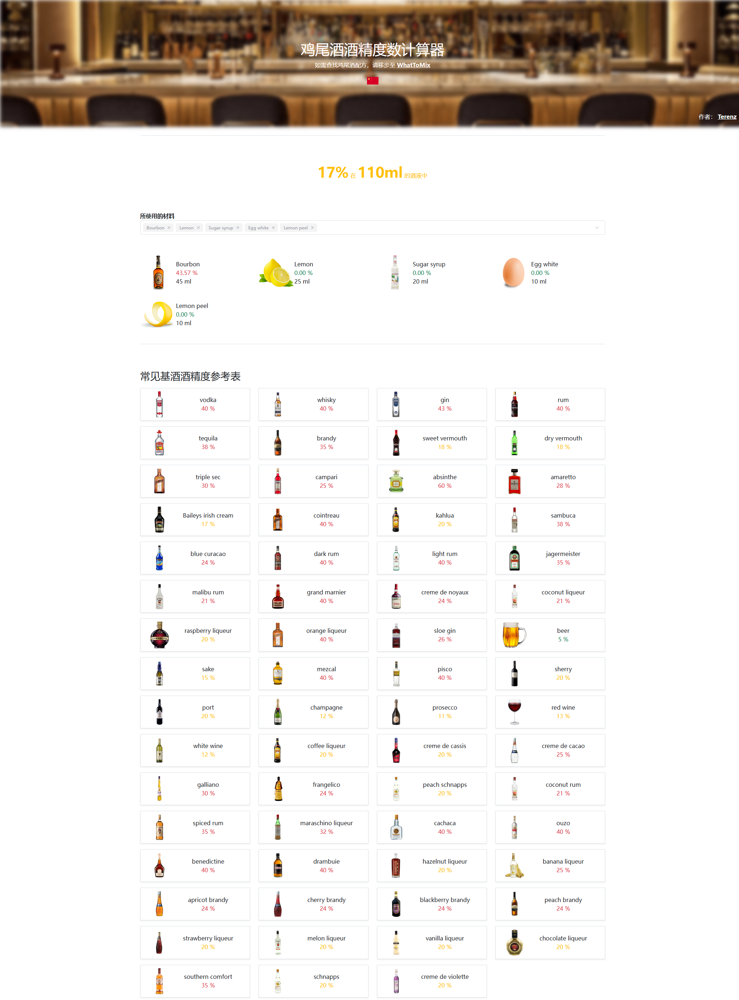

# AlcoCalc

### 1. **输入鸡尾酒配方**

- **内置常用材料**：系统内置了常用的鸡尾酒材料（酒精和非酒精成分），用户可以直接选择。
- **材料配置**：选择材料后，用户需要进一步配置每种材料的详细信息，包括酒精度数（ABV%）、使用体积以及体积单位。
- **选择单位**：支持用户选择体积单位（如盎司、毫升），确保输入数据的灵活性。

### 2. **计算酒精度数（ABV）**

- **自动计算**：根据用户输入的酒精成分和非酒精成分的比例，自动计算鸡尾酒的总酒精浓度（ABV）。
- **结果显示**：显示详细的计算结果，包括每种酒的酒精含量、鸡尾酒的总酒精浓度以及总液体体积。

### 3. **保存和分享配方** (TODO)

- **保存功能**：用户可以保存自己创建的鸡尾酒配方，方便日后查看或修改。
- **分享功能**：提供分享选项，用户可以将配方或计算结果分享给朋友或发布到社交媒体。

### 4. **国际化** (TODO)

- **多语言支持**：提供英文和中文界面，满足不同语言用户的需求，提升用户体验。

### 截图

